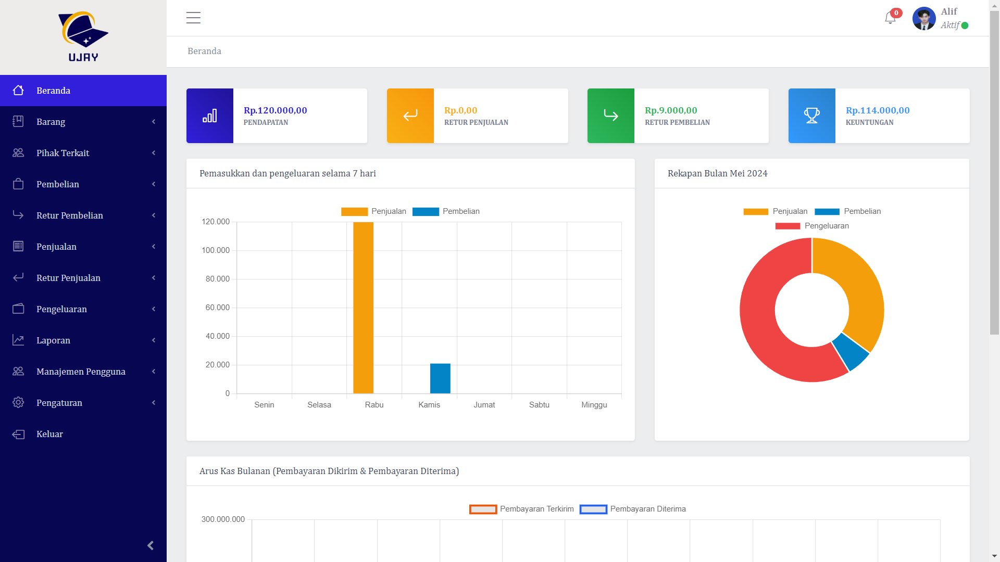

> **Important Note:** This Project is ready for Production. But use code from main branch only. If you find any bug or have any suggestion please create an Issue.

# Local Installation

- run `` git clone https://github.com/zalzdarkent/POS-first.git ``
- run ``composer install `` 
- run `` npm install ``
- copy .env.example to .env
- run `` php artisan key:generate ``
- set up your database in the .env
- run `` php artisan migrate --seed ``
- run `` php artisan storage:link ``
- run ``npm run dev``
- run `` php artisan serve ``
- then visit `` http://localhost:8000 or http://127.0.0.1:8000 ``.

> **Important Note:** "Triangle POS" uses Laravel Snappy Package for PDFs. If you are using Linux then no configuration is needed. But in other Operating Systems please refer to [Laravel Snappy Documentation](https://github.com/barryvdh/laravel-snappy).

# Admin Credentials
> Email: admin@test.com || Password: 12345678

## Demo

**Live Demo:** will update soon

## Inventory Management Features

- **Products Management & Barcode Printing**
- **Stock Management**
- **Make Quotation & Send Via Email**
- **Purchase Management**
- **Sale Management**
- **Purchase & Sale Return Management**
- **Expense Management**
- **Customer & Supplier Management**
- **User Management (Roles & Permissions)**
- **Product Multiple Images**
- **Multiple Currency Settings**
- **Unit Settings**
- **System Settings**
- **Reports**
